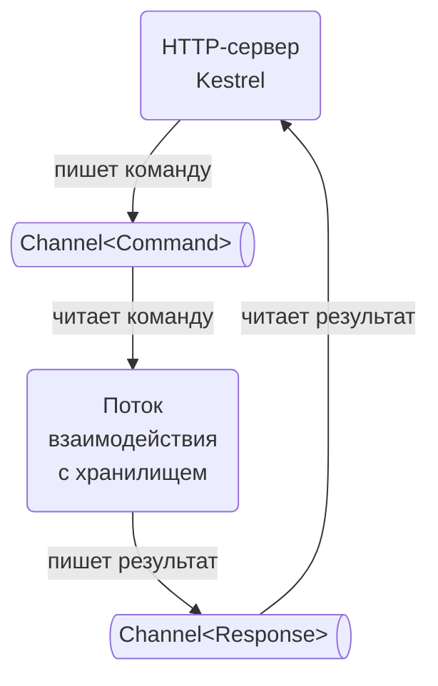

# PA9. Хранилище ключ-значение

**Цель:** реализовать прототип распределённой СУБД, работающей по модели "ключ-значение"

- Задание делается с нуля
- Это необязательная лабораторная — вы можете выбирать или не выбирать её на своё усмотрение

# Задание

Лабораторная содержит три задания. Для сдачи лабораторной вы должны выполнить все три.

## Задание 1. СУБД с моделью "ключ-значение"

Реализуйте сервис `ProtoKey`, представляющий собой прототип хранилища, работающего по модели "ключ-значение", по списку требований:

1. API для работы с хранилищем — HTTP запросы (REST API)
2. Поддерживаются три операции — set, get, keys
    - операция `set(key, value)` устанавливает значение по ключу, сложность O(1)
    - операция `get(key)` возвращает значение по ключу либо число 0, если ключа нет, сложность O(1)
    - операция `keys(prefix)` возвращает список ключей, имеющих заданный префикс, сложность O(N)
3. Есть ограничения на ключи и значения
    - ключ — строка от 1 до 1000 символов из следующего набора: `a-z`, `A-Z`, `0-9`, `_`, `-`, `.`
    - значение — 32-битное целое (от -2147483648 до 2147483647)
    - если ключ или значение некорректны, возвращается 400 Bad Request
4. Сервис хранит значения in-memory, то есть в хеш-массиве
    - тип `Dictionary<string, int>` в C#
    - тип `map[string]int` в Go
5. **Изменение словаря должно выполняться в одном потоке**
    - в C# этого можно достичь, запустив `Thread` либо `BackgroundService` и взаимодействуя с ним через `Channel` либо через `BlockingCollection`
    - в Go этого можно достичь, запустив goroutine с двумя каналами для взаимодействия с ней
6. Код в целом должен быть асинхронным
    - длительные синхронные операции не приветствуются

Схема внутреннего устройства хранилища:



## Задание 2. Утилита командной строки

Помимо хранилища следует разработать консольную утилиту `ProtoCli`, предоставляющую консольный интерфейс к хранилищу:

1. Утилита поддерживает три команды
    - `set <key> <value>` устанавливает значение — например, `set "requests_total" 17`
    - `get <key>` возвращает значение — например, `get "requests_total"`
    - `keys <prefix>` возвращает список ключей — например, `keys ""` или `keys "req"`
2. Утилита взаимодействует с сервисом `ProtoKey`, выполняя HTTP-запросы

Ожидаемый URL сервиса `ProtoKey` на данном этапе можно сделать строкой константой в `ProtoCli`, например:

```csharp
class Program
{
    private const string ProtoKeyHost = '127.0.0.1:7777';

    // ...
}
```

## Задание 3. Сохранение данных

Хранилище должно обеспечивать резервирование данных на диске на случай штатного либо аварийного перезапуска:

1. Новые команды дублируются в файл `ProtoKey.data` на диске с частотой в одну секунду
2. При запуске `ProtoKey` сканирует этот файл и выполняет указанные в нём команды

Сделать это в C# можно следующим образом:

1. Ввести дополнительный `Thread` или `BackgroundService`, который получает копию **успешно** обработанных команд через `Channel<Command>` и раз в секунду сохраняет их на диск
2. Обеспечить запуск метода сохранения команд можно с помощью `Timer`

## Необходимые диаграммы

Перед сдачей следует нарисовать две диаграммы (на листе бумаги или электронно):

1. Схема внутреннего устройства `ProtoKey` с учётом сохранения данных на диск
2. UML Sequence диаграмма, показывающая обработку команды `set`

## Бонус +2 балла при наличии хороших тестов

Бонус даётся, если `ProtoKey` покрыт исчерпывающими тестами. Возможны три варианта:

1. Модульные тесты для подсистемы выполнения команд и подсистемы резервирования данных на диске
2. Интеграционные тесты для `ProtoKey`, запускающие `TestServer` и выполняющие команды в рамках основных сценариев использования
3. Сквозные тесты для `ProtoKey` и `ProtoCli`, запускающие сценарии над `ProtoKey` с помощью утилиты `ProtoCli`

В любом случае следует протестировать как выполнение команд, так и резервирование данных в файл `ProtoKey.data` и восстановление из него.

## Ссылки

Для C#:

- [Самый простой и подробный гайд по конкурентным коллекциям в C#](https://habr.com/ru/companies/ruvds/articles/791308/) / Habr
- [System.Threading.Channels — высокопроизводительный производитель-потребитель и асинхронность без аллокаций и стэк дайва](https://habr.com/ru/articles/508726/) / Habr
- [Интеграционные тесты для ASP.NET Core](https://habr.com/ru/articles/860932/)
